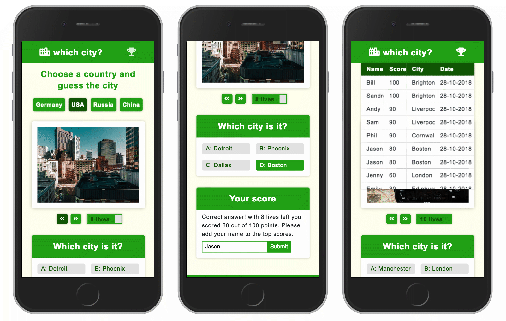

# Which City?
## Quiz game app
To play the **Which City?** quiz game simply choose a country, browse the photos and try to guess which city it is. It is designed for mobile view and offers a user-friendly experience.

> [View live demo](https://rlevy-which-city.netlify.com)

> [View repo on Github](https://github.com/rolandjlevy/which-city)

## Installation and set up
+ Clone this repo
+ Run `npm install` to install dependencies
+ Run `npm run dev` to create a development build with webpack
+ Open index.html file in the browser

## Functionality and features
+ The game begins with the user selecting a country 
+ A city of the selected country is chosen randomly
+ The app fetches 10 relevant photos for that city from the [Unsplash photos](http://www.unsplash.com) API
+ Filtering functions ensure that the photos are relevant to the city
+ The app then uses React and SCSS to display the photos 
+ The user then tries to guess the city by going through the photos
+ For each photo that is seen one life is lost
+ When the user finally makes a choice the result and score are displayed
+ If the answer is correct the user can enter their name into the top scores table using localStorage

## Technology used
+ React
+ Classnames
+ BEM
+ Flex-box
+ SCSS
+ Unsplash API
+ Webpack

## Stages of development
+ Set up API and read the **Unsplash API** documentation 

## Desired features with more time
+ Implement the ipad and desktop view for better responsiveness
+ Run some unit testing

